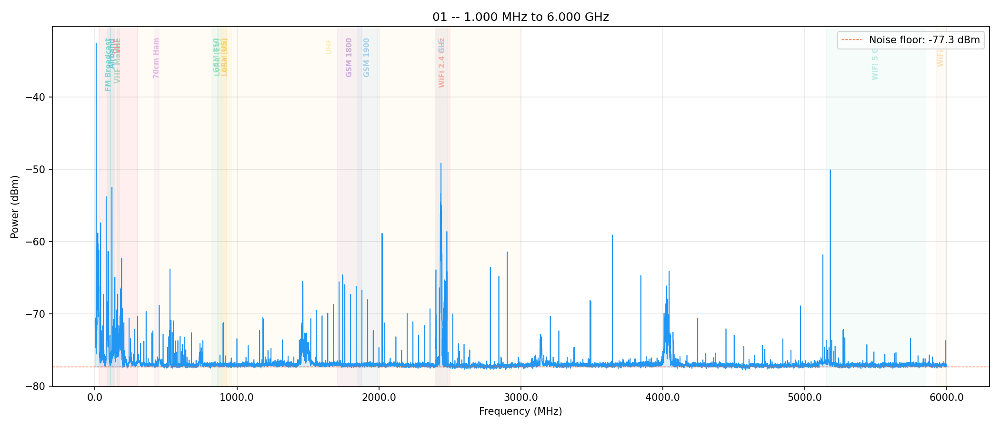
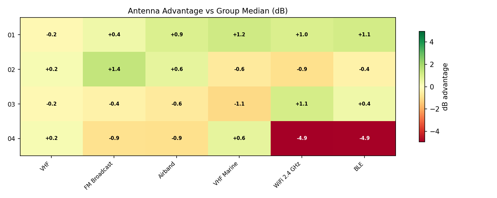
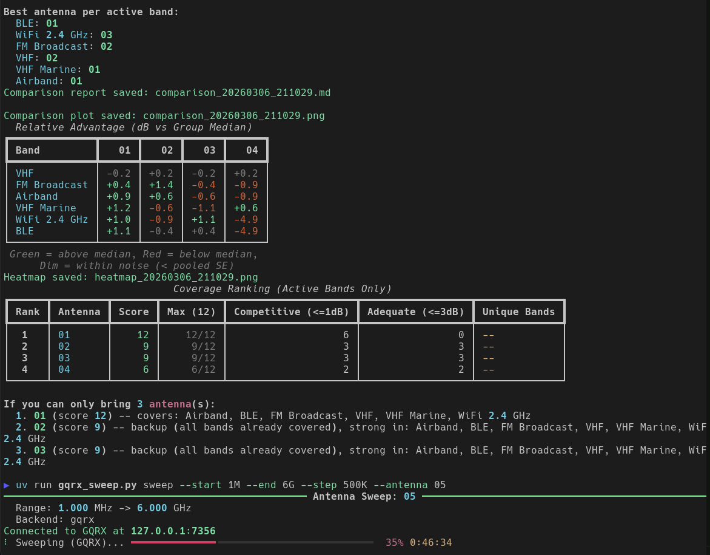

# Antenna Sweep & Comparison Tool

A dual-backend antenna comparison tool supporting [GQRX](https://gqrx.dk/) (any radio via TCP remote control) and `hackrf_sweep` (HackRF-specific fast sweeps). Sweeps spectrum, measures signal strength per frequency bin, optionally subtracts a baseline sweep to isolate antenna gain from ambient conditions, and compares multiple antennas with per-band statistical ranking.

## What It Does

1. **Sweep** -- Tunes through a frequency range, records power at each bin, saves CSV + PNG plot + markdown report
2. **Baseline subtraction** -- Subtract a reference sweep (e.g. 50-ohm terminator) to isolate antenna gain from receiver noise floor
3. **Compare** -- Loads all sweep CSVs in the current directory and produces:
   - P90-based per-band ranking with activity detection
   - Relative advantage table (each antenna vs group median)
   - Diverging heatmap PNG for visual comparison
   - Coverage ranking with greedy set-cover ("if you can only bring N antennas")
   - Overlay plot with per-band recommendation panel

## Screenshots

### Single Antenna Sweep Plot



### Comparison Heatmap



### Compare Command Output



## Quick Start

### Prerequisites

- **Python 3.12+**
- **[uv](https://docs.astral.sh/uv/)** (dependencies are declared inline via `uv` script headers -- no manual install needed)
- **GQRX** with Remote Control enabled (`Tools > Remote Control > Start`) for the `gqrx` backend
- **hackrf_sweep** on `PATH` for the `hackrf` backend (part of [hackrf](https://github.com/greatscottgadgets/hackrf) tools)

### Workflow

```bash
# 1. Sweep a baseline (50-ohm terminator or reference antenna)
uv run gqrx_sweep.py sweep --antenna baseline --start 1M --end 6G --backend hackrf --sweeps 100

# 2. Sweep each antenna under test
uv run gqrx_sweep.py sweep --antenna "Diamond X-50" --start 1M --end 6G --backend hackrf --sweeps 100
uv run gqrx_sweep.py sweep --antenna "Nagoya NA-771" --start 1M --end 6G --backend hackrf --sweeps 100

# 3. Compare all sweeps
uv run gqrx_sweep.py compare
uv run gqrx_sweep.py compare --top-n 2
```

## Subcommands

### `sweep` -- Run a single antenna sweep

```bash
uv run gqrx_sweep.py sweep --antenna <NAME> --start <FROM> --end <TO> [options]
```

Frequencies accept suffixes: **K** (kHz), **M** (MHz), **G** (GHz)

#### Common Options

| Flag | Default | Description |
|------|---------|-------------|
| `--antenna` | *required* | Name of the antenna under test |
| `--start` | *required* | Start frequency (e.g. `88M`) |
| `--end` | *required* | End frequency (e.g. `108M`) |
| `--backend` | `gqrx` | Sweep backend: `gqrx` or `hackrf` |
| `--baseline` | *auto* | Baseline CSV to subtract (auto-detects `baseline.csv` if present) |
| `--no-plot` | off | Skip PNG plot generation |

#### GQRX Backend Options

| Flag | Default | Description |
|------|---------|-------------|
| `--host` | `127.0.0.1` | GQRX IP address |
| `--port` | `7356` | GQRX remote control port |
| `--step` | `100K` | Step size (e.g. `500K`) |
| `--mode` | *unchanged* | Set demod mode: `FM` `AM` `WFM` `USB` `LSB` `CW` |
| `--dwell` | `0.5` | Seconds to wait at each step before sampling |
| `--samples` | `3` | Number of readings to average per step |

#### HackRF Backend Options

| Flag | Default | Description |
|------|---------|-------------|
| `--lna-gain` | `16` | LNA gain 0-40, 8 dB steps |
| `--vga-gain` | `22` | VGA gain 0-62, 2 dB steps |
| `--bin-width` | `100000` | Bin width in Hz |
| `--amp` | off | Enable RF amplifier |
| `--sweeps` | `1` | Number of passes to average (higher = less noise) |

#### Sweep Examples

```bash
# FM broadcast band via GQRX on a remote Pi
uv run gqrx_sweep.py sweep --antenna "Whip" --host 192.168.1.50 --start 88M --end 108M --step 500K

# 2-meter ham band, slower dwell for accuracy
uv run gqrx_sweep.py sweep --antenna "Yagi" --start 144M --end 148M --step 100K --dwell 1.0

# Full HackRF wideband sweep, 100 passes averaged
uv run gqrx_sweep.py sweep --antenna "Discone" --start 1M --end 6G --backend hackrf --sweeps 100
```

#### Sweep Output Files

Each sweep produces:
- `sweep_<name>_<timestamp>.csv` -- Raw frequency/power data with metadata header
- `sweep_<name>_<timestamp>.png` -- Spectrum plot with band overlays and noise floor
- `sweep_<name>_<timestamp>.md` -- Summary report with per-band metrics table

Baseline sweeps (`--antenna baseline`) save as `baseline.csv` and are auto-detected by subsequent sweeps and comparisons.

### `compare` -- Compare multiple antenna sweeps

```bash
uv run gqrx_sweep.py compare [options]
```

Auto-discovers all `sweep_*.csv` files in the current directory.

| Flag | Default | Description |
|------|---------|-------------|
| `--baseline` | *auto* | Baseline CSV for normalization (auto-detects `baseline.csv`) |
| `--output` | auto | Output PNG filename (default: `comparison_<timestamp>.png`) |
| `--top-n` | `3` | Number of antennas for set-cover recommendation |

#### Compare Output Files

- `comparison_<timestamp>.md` -- Per-band ranking, relative advantage table, coverage ranking
- `comparison_<timestamp>.png` -- Overlay plot with per-band recommendation panel
- `heatmap_<timestamp>.png` -- Diverging heatmap of dB advantage vs group median

## How Analysis Works

### Per-Band Scoring

The tool knows about common frequency bands (VHF, FM Broadcast, Airband, VHF Marine, UHF, 70cm Ham, GSM 850/900/1800/1900, LoRa US/EU, WiFi 2.4/5 GHz, WiFi 6E, BLE) and scores each antenna within every band that overlaps the sweep range.

**P90 (90th percentile power)** is the primary comparison metric -- it captures actual signal reception while ignoring noise-floor bins that dominate the mean.

### Activity Detection

Bands are marked "active" (worth comparing) when either:
- **Within-band std >= 2.0 dB** -- spectral variation indicates real signals
- **Between-antenna P90 spread >= 1.5 dB** -- antennas disagree, indicating real gain differences

Inactive bands (pure noise floor) are dimmed in the output.

### Coverage Ranking & Set-Cover

Each antenna is scored across active bands:
- **+2 points** per band within 1 dB of best (competitive)
- **+1 point** per band within 3 dB of best (adequate)

A greedy set-cover algorithm then answers: "if you can only bring N antennas, which ones cover the most bands?"

## How It Works Under the Hood

**GQRX backend** speaks the Hamlib `rigctld` protocol over TCP:
- `F <hz>` -- Set frequency
- `l STRENGTH` -- Read signal strength (dBFS)
- `M <mode> <bw>` -- Set demodulator mode

**HackRF backend** shells out to `hackrf_sweep` and parses its CSV output. Multiple passes (`--sweeps N`) are averaged per frequency bin to reduce noise.

## CSV Format

```csv
# antenna: Diamond X-50
# date: 2026-03-07T14:30:00
# start_hz: 1000000
# end_hz: 6000000000
# backend: hackrf_sweep
# noise_floor_dbm: -45.2
frequency_hz,power_dbm
1050000,-42.3
1150000,-41.8
...
```

## Tips

- **Baseline matters** -- Always sweep a 50-ohm terminator or reference antenna first. This lets you see actual antenna gain rather than ambient RF.
- **More sweeps = cleaner data** -- For HackRF, `--sweeps 50-100` dramatically reduces noise. Single-pass data is noisy.
- **Step size tradeoff** -- Smaller steps give finer resolution but take longer (GQRX backend). Start coarse, then zoom into interesting ranges.
- **Ctrl+C is safe** -- Sweeps can be interrupted; you'll get results for frequencies already measured.
- **Keep CSVs together** -- The `compare` command discovers all `sweep_*.csv` in the current directory. Organize antenna tests in per-session directories.
